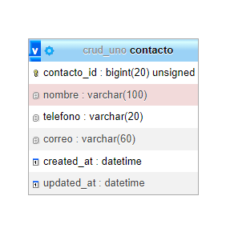
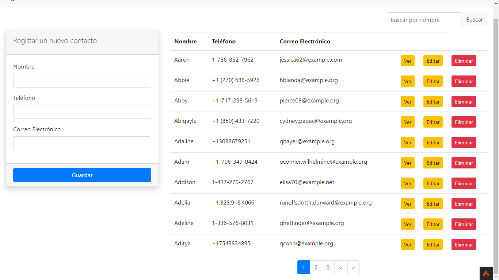
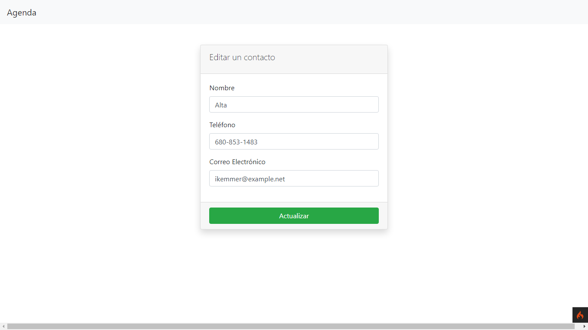
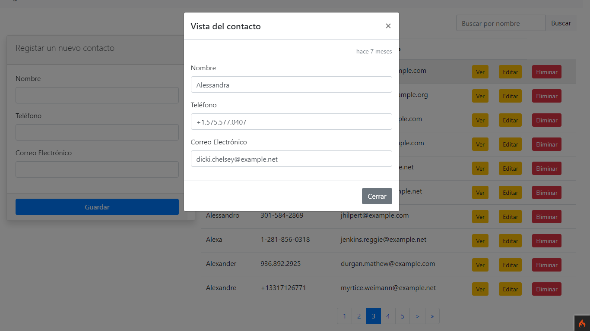
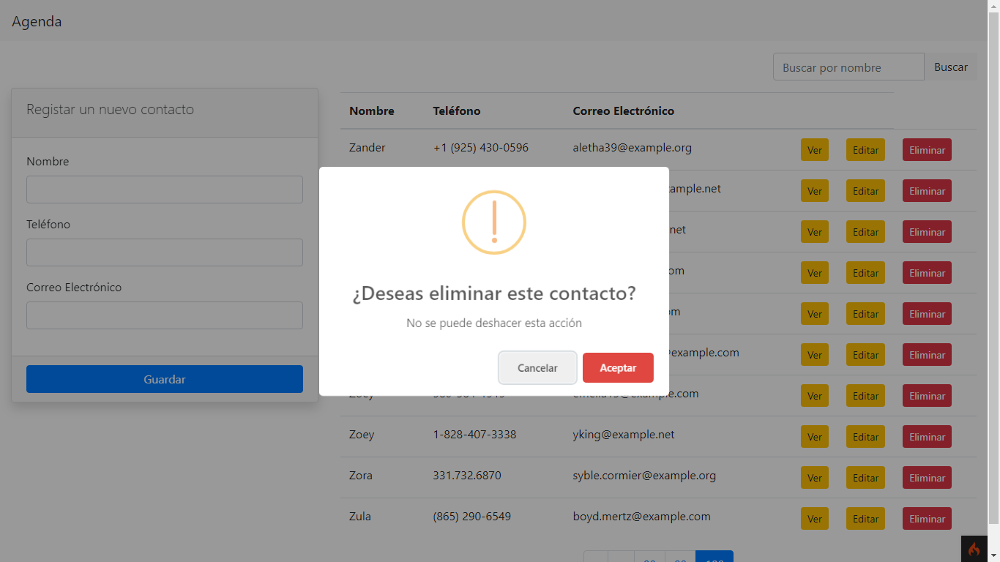
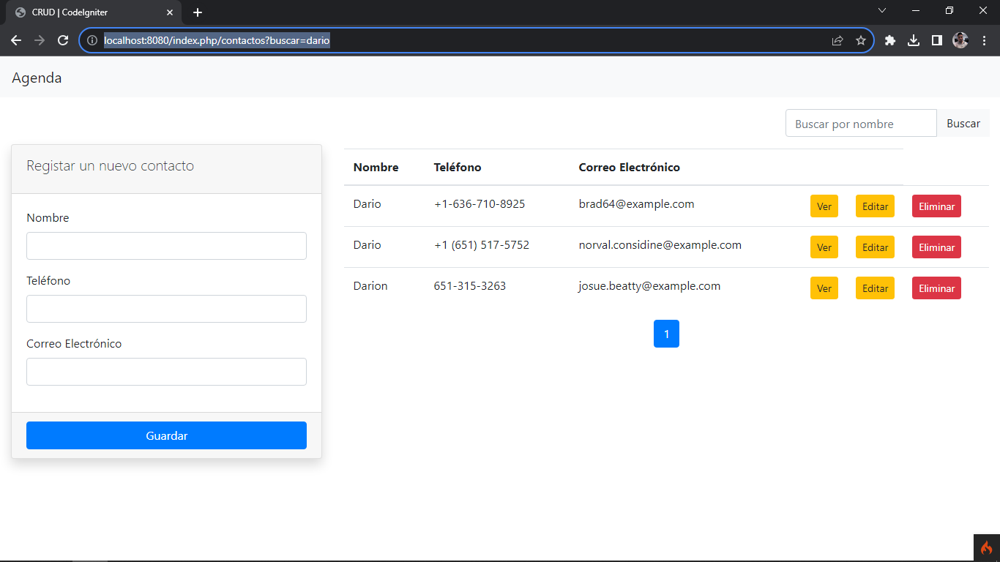
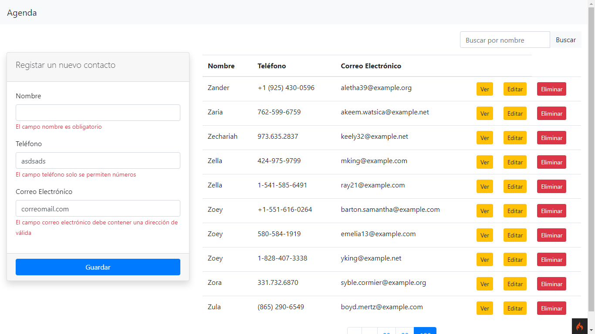

# Agenda Codeigniter - Descripción
Es un proyecto realizado con el framework PHP Codeigniter 4 que integra jQuery y realiza peticiones AJAX. Además utiliza Bootstrap. 

Es un CRUD que se utiliza una agenda de contactos para realizar las operaciones de insertar, actualizar, eliminar y listar. También realiza la paginación sin perdida de parámetros en la búsqueda

Tambien se utilizo algunos plugins de javascript como:
 - sweet alert (mensajes de alerta) 
 - moment.js (trabajar con formatos de tiempo y fechas)

# Requerimientos
- php 8.1
- CodeIgniter 4.4.0
- phpMyAdmin

# Primeros pasos

## Descargar o clonar este repositorio
```
git clone https://github.com/olmos-dev/agenda-codeigniter.git
```

## Carpeta Vendor
Para descargar los archivos necesarios del framework Codeigniter de la carpeta vendor ejecuta la siguiente linea de comandos

```
composer update
```

## Crear archivo .env
Copia y pega lo que contiene el archivo env (se encuentra en la raiz del proyecto) a un nuevo archivo y renombrarlo como .env

## Ajustar las variables de entorno en .env

Puedes cambiar por production ó develoment
```
CI_ENVIRONMENT = development
```

## Configurar la Base de datos
Debes de descomentar las lineas y ajusta los parametros de acuerdo a las credenciales de tu base de datos
```
database.default.hostname = localhost
database.default.database = crud_uno
database.default.username = root
database.default.password = 
database.default.DBDriver = MySQLi
# database.default.DBPrefix =
database.default.port = 3306
```

## Crear base de datos
crear una base de datos llamada crud_uno

## Importa la base de datos 
Importa la base de datos que se encuentra en este proyecto en la carpeta files llamada "crud_uno"

# Ejecutar el proyecto
Ejecuta con el servidor que provee codeigniter

```
php spark serve
```

Ahora desde tu navegador ve al siguiente enlace
```
http://localhost:8080/contactos
```
# Documentación

## Construido con
- **php 8.1**
- **Codeigniter 4.4.1**
- **MySQL**
- **jQuery**
- **Ajax**
- **Bootstrap**
- **Sweet Alert**
- **Moment.js**

## Base de datos - tabla contacto



## Screenshots

### Inicio

Se muestra la página principal de la agenda de contactos
- Al lado izquierdo se muestra el formulario de registro 
- Al lado derecho se muestra el listado de los contactos. 
- En la parte superior derecha se puede realizar búsquedas
- En la parte inferior está la paginación 


### Editar un contacto

Se muestra el formulario para la edicion de un contacto

### Mostrar un contacto

Se muestra un modal que contiene la vista previa de un contacto y la peticon se realiza a travez de ajax

### Eliminar un contacto

Se realiza una peticion ajax y se muestra una alerta para eliminar el contacto


### Buscar un contacto

Se pueden realizar busquedas

### Validaciones

Se muestran los errores de validacion. Aplican al registar y editar un contacto.

